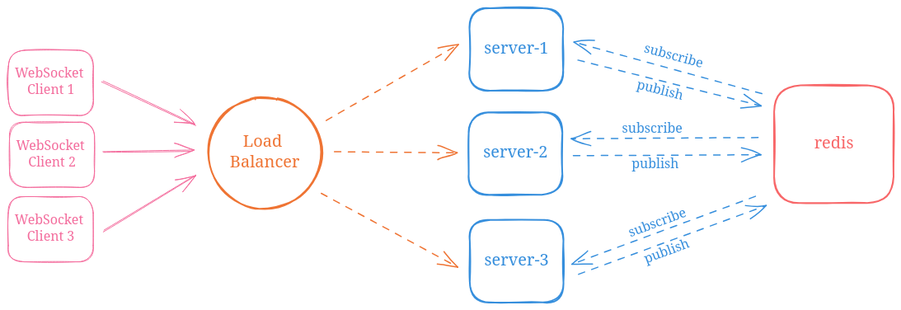
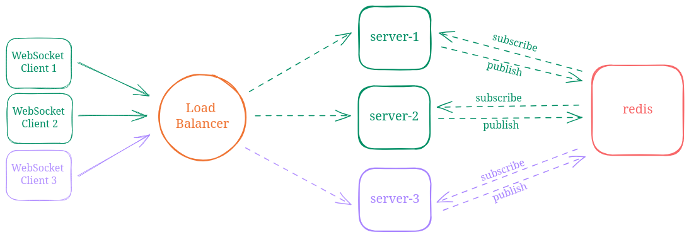

# Disposable Chat
Chat room server via web sockets. Join a room and send messages to all clients registered to it.

Web client available at [lucasmauro/disposable-chat-client](https://github.com/lucasmauro/disposable-chat-client).

## Usage
Open a websocket connection with `ws://{host}:{post}/ws?name={name}&room={room}`. Note the `name` and the `room` string parameters.

The specified room will be created if it does not exist.

### Payload
By sending messages to the server, you must addhere to the following structure:
```
{
  "text": "your message here"
}
```

## Running the server
Create a `.env` file based on `.env-example` and simply run `make run`.

### Environment Variables
| Variable          | Description                                               | Example
| ----------------- | --------------------------------------------------------- | ----
| ACCEPTED_ORIGIN   | 'Origin' header to be validated upon new connections      | domain.com
| LOG_DEBUG         | whether or not to print debug logs                        | true
| REDIS_ENDPOINT    | redis endpoint                                            | redis.com:6379
| REDIS_SECRET      | redis secret (if any)                                     | safe-passw0rd

## Message types
Clients are expected to receive messages of different types from the server.

### Info
Useful information for the connected client, other clients that have registered to or unregistered from a room.

### Chat
Broadcast of a message sent by one of the clients.

## Architecture



Uppon connection, clients are routed via the load balancer to an available server. Redis is used to synchronise the servers on room events via [Pub/Sub](https://redis.io/docs/latest/develop/interact/pubsub/).

### Example scenario
Both **WebSocket Client 1** and **WebSocket Client 2** join `room-A`, being that the first is routed to **server-1** and the latter to **server-2**. Each server has the connection state of its client, but neither have direct access to what the client on the other server may send.

This is briged with **redis**. Upon receiving a message from a connected *client*, the *server* publishes it to **redis** on the channel related to the given room. All other *servers* that have subscribed to this same channel are notified and then proceed to send this message to all *clients* connected to the given room.



Considering that **WebSocket Client 3** has connected **server-3** and joined `room-B` instead of `room-A`, then **server-3** would <u>**not**</u> be subscribed to the channel related to `room-A` and therefore have no knowledge nor traffic to handle about this room.
